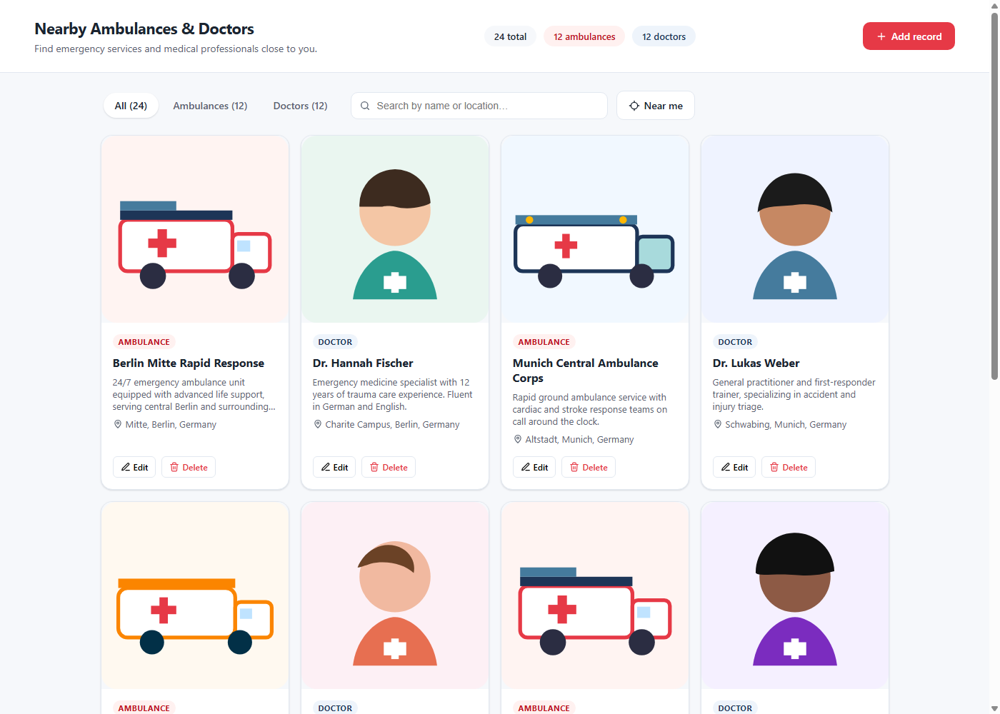

# Nearby Ambulances & Doctors

A full-stack app for finding nearby ambulance services and doctors, with full CRUD management. Built for the JOIN coding challenge.



## Features

**Must-haves**
- Add, edit, and delete ambulances and doctors
- Paginated list (10 per page) with running totals in the header
- Each record shows title, description, location, and an image
- Loading, error, and empty states

**Nice-to-haves**
- **Near me**: uses the browser's Geolocation API to sort the list by distance (haversine formula) and shows a distance badge on each card
- Search by title/description/location, and filter by type (All / Ambulances / Doctors)
- Styled-components theme, responsive card grid, skeleton loading state
- npm workspaces monorepo with a single `npm run dev` to boot both servers

## Tech stack

| | |
|---|---|
| Frontend | React 19, TypeScript, Vite, styled-components, Jest + React Testing Library |
| Backend | Node.js, Express, TypeScript, Zod (validation), Jest + Supertest |
| Storage | Flat JSON file (`backend/src/data/db.json`), seeded from `seed.json` on first run |

## Project structure

```
backend/
  src/
    data/seed.json     24 seed records (12 ambulances, 12 doctors) across world cities
    store.ts           JSON-file repository: list/filter/search/paginate + CRUD
    routes/services.ts Express routes
    schema.ts           Zod request validation
  public/images/        hand-drawn SVG placeholder images served statically
  tests/                Jest + Supertest

frontend/
  src/
    api/                typed fetch client
    hooks/              useServices (list state), useGeolocation
    components/         Header, Tabs, SearchBar, ServiceCard, ServiceList, Pagination,
                         ServiceFormModal, ConfirmDialog, NearMeButton
    utils/distance.ts   haversine distance calculation
```

## Getting started

Requires Node.js 20+.

```bash
npm install        # installs both workspaces (root uses npm workspaces)
npm run dev        # starts backend (:4000) and frontend (:5174 or next free port)
```

Open the frontend URL printed in the terminal. The backend seeds itself from
`backend/src/data/seed.json` into `backend/src/data/db.json` on first run — delete
`db.json` at any time to reset back to the seed data.

Other useful scripts (run from the repo root, across both workspaces):

```bash
npm run build      # type-check + build both workspaces
npm run test       # run backend (Jest+Supertest) and frontend (Jest+RTL) suites
npm run lint       # ESLint for both workspaces
```

## API reference

Base URL: `http://localhost:4000`

| Method | Path | Description |
|---|---|---|
| GET | `/api/services?type=&q=&page=&limit=` | List, paginated (`page`/`limit` default 1/10). `type` is `ambulance` or `doctor`. `q` searches title/description/location. |
| GET | `/api/services/:id` | Fetch one record |
| POST | `/api/services` | Create (body validated with Zod) |
| PUT | `/api/services/:id` | Update |
| DELETE | `/api/services/:id` | Delete |

List responses include `totals: { all, ambulance, doctor }` so the UI can show
running counts independent of the current filter/page.

## Design decisions

- **Unified data model.** Ambulances and doctors share one `Service` shape
  (`type: 'ambulance' | 'doctor'` plus the fields the brief requires) instead of
  two parallel models — the displayed fields are identical for both, so a single
  resource with a discriminator is simpler than duplicating everything.
- **JSON file store, not SQLite.** The brief allows either. A flat-file store
  has no native dependency to compile, which is one less thing that can fail
  across platforms/CI, and is easily swappable behind `store.ts` if a real
  database were needed later.
- **Local placeholder images.** Seed images are small hand-authored SVGs served
  by the backend rather than hot-linked to an external image host, so the app
  works fully offline and demo data never breaks due to a dead link.
- **No deployment.** The brief doesn't require it; running both servers locally
  via `npm run dev` was prioritized over hosting setup.

## Testing

- Backend: `backend/tests/store.test.ts` (pagination/filter/search/CRUD logic)
  and `backend/tests/services.test.ts` (Supertest against every route, including
  validation and 404 paths).
- Frontend: component tests for `ServiceCard`, `ServiceList` (loading/error/empty/
  populated), `Pagination`, `ServiceFormModal` (validation), the `useServices`
  hook, and the `distance` utility.

## AI usage

See [AI_USAGE.md](AI_USAGE.md) for how Claude Code was used throughout this project.
